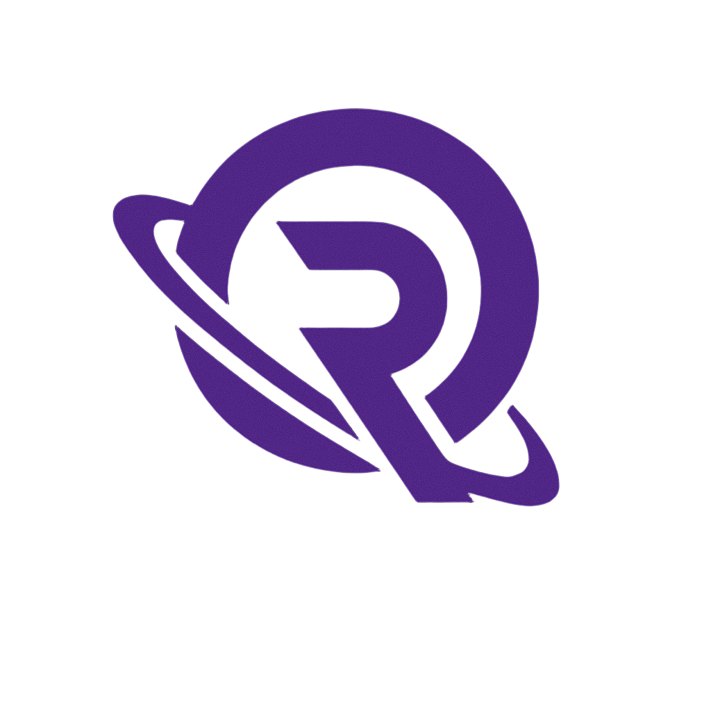

<p align="center">
  
</p>

<h1 align="center">ORBITAL ROXA</h1>

<p align="center">
  <strong>Plataforma completa de campeonatos CS2 com HUD ao vivo, highlights automaticos e controle de transmissao via mobile.</strong>
</p>

<p align="center">
  <a href="https://www.orbitalroxa.com.br">orbitalroxa.com.br</a>
</p>

<p align="center">
  
  
  
  
  
  
</p>

---

## Sobre

ORBITAL ROXA e um ecossistema end-to-end para organizar, transmitir e analisar campeonatos de Counter-Strike 2 -- presenciais e online. Cobre desde a inscricao de times ate highlights automaticos pos-partida, passando por HUD de transmissao com controle remoto via celular.

O projeto nasceu da necessidade real de uma plataforma completa para campeonatos presenciais no Brasil, onde nao existia solucao integrada que unisse gestao de torneio, transmissao profissional e branding em um so lugar.

---

## Stack

| Camada | Tecnologias |
|--------|-------------|
| **Frontend** | Next.js 15, React 19, Tailwind CSS v4, Framer Motion |
| **Backend** | Node.js, Express, TypeScript, MariaDB, Redis |
| **HUD Overlay** | Electron, React 18, Socket.IO, CSGOGSI |
| **Highlights** | Python, demoparser2, FFmpeg, Pillow |
| **IA** | Claude Haiku (captions, analise de midia) |
| **Infra** | Vercel, Railway, Cloudflare R2, Vercel Blob |
| **Integracoes** | Steam OAuth, Faceit API, Meta Graph API, Google Drive API, OBS WebSocket |

---

## Arquitetura

```
                         TRANSMISSAO

  Celular --> Mobile Control Panel --> Express API
                                         |
  OBS <-- Captura de Janela <-- Electron HUD Overlay
                                         |
  CS2 Server (MatchZy) --> GSI --> Socket.IO --> HUD


                        PLATAFORMA WEB

  Usuario --> Vercel (Next.js 15 SSR/CSR)
                |-- Paginas publicas (partidas, ranking)
                |-- Admin (torneios, times, inscricoes)
                |-- Brand Command Center (IA)
                |-- Loja Online
                |-- /api/* proxy --> G5API (Railway)
                                      |
  G5API <-- RCON --> CS2 Server (MatchZy)
    |
    |-- MySQL (dados + torneios + brand + loja)
    |-- Cloudflare R2 (highlights)
    |-- Vercel Blob (logos)
```

---

## Features

### Gestao de Campeonatos
- **Double Elimination** -- Bracket fixo de 8 times, 15 partidas com propagacao automatica winner/loser
- **Swiss System** -- 8-16 times, rounds dinamicos, Buchholz tiebreaker, BO3 em rounds decisivos
- **Mission Control** -- Painel de operador com veto ao vivo, start de partida, auto-advance
- **Modos** -- Presencial (G5API + MatchZy) ou Online (Faceit + webhook auto-advance)

### HUD de Transmissao
- **Overlay em tempo real** -- Placar, player boxes, radar, observed player via Game State Integration
- **Controle Mobile** -- Painel web no celular pra controlar toda a transmissao sem alt+tab
- **Tela de Pausa** -- Voltamos Ja, Intervalo, Pausa Tecnica (fullscreen com tipos selecionaveis)
- **Countdown Timer** -- Timer regressivo controlado pelo operador
- **MVP do Mapa** -- Card automatico do melhor jogador com K/D/A
- **Trivia** -- Pop-ups de informacao ao vivo na HUD
- **Killfeed** -- Feed de kills injetado com icones de headshot/wallbang/smoke
- **Instant Replay** -- Integracao OBS Replay Buffer via WebSocket, ativado pelo celular
- **Propaganda** -- Video animado fullscreen de 21s com audio (Remotion), ativado pelo celular
- **Sponsor Box** -- Imagem de patrocinador uploadavel pelo admin
- **Toggle de Elementos** -- Liga/desliga player boxes, scoreboard, radar, killfeed em tempo real
- **Tela de Resultado** -- Aparece automaticamente ao fim do mapa com stats dos jogadores
- **Indicador GSI** -- LED verde/vermelho mostrando conexao com CS2
- **Atalhos globais** -- Shift+W (overlay), F5 (refresh)

### Highlights Automaticos
- **Pipeline** -- demoparser2 -> CSDM/HLAE -> FFmpeg + Pillow -> upload Cloudflare R2
- **Scoring** -- Kills x multiplicadores (headshot 1.5x, smoke 1.3x, wallbang 1.5x)
- **HUD customizado** -- Barra animada com avatar, time logo, kills/assists
- **45 clips** processados (4.1GB no R2)

### Awards Automaticos
- MVP, Entry King, HS Machine, Kill Machine, Multi-Kill King, Utility Master
- Calculados com base nos player_stats do campeonato

### Stats e Ranking
- **Leaderboard** com K/D, ADR, KAST, HS%, Rating
- **Perfil do jogador** com Open Graph dinamico (imagem gerada on-the-fly via Edge Runtime)
- **Post-match card** exportavel em PNG 1080x1080

### Integracoes
- **Steam OAuth** -- Login via Steam com cookie proxy pra cross-domain
- **Faceit** -- Sync de stats, webhook de match status, mapeamento via Steam ID
- **MatchZy** -- Plugin CS2 com RCON, match config via HTTP, eventos em tempo real
- **OBS WebSocket** -- Controle de replay buffer e status de conexao
- **Instagram Graph API** -- Publicacao direta de posts com IA gerando captions
- **Google Drive** -- IA analisa fotos visualmente pra sugerir midia pros posts

### Loja Online
- Carrinho, checkout PIX
- Admin CRUD de produtos + gestao de pedidos
- Stock verificado e decrementado atomicamente (race-condition safe)

### Inscricoes Online
- Formulario publico com vagas limitadas
- Pipeline admin: pendente -> aprovado -> pago
- Auto-cadastro de time no G5API ao aprovar

### Brand Command Center
- IA (Claude Haiku) gera captions, hashtags, sugere midia do Google Drive
- Calendario editorial + criacao + publicacao no Instagram
- Tom: gamer adulto, confiante, direto

---

## Ecossistema

| Projeto | Descricao | Stack |
|---------|-----------|-------|
| `orbital-cs2/` | Frontend + API proxy + Loja + Brand | Next.js 15, Tailwind v4, Framer Motion |
| `orbital-hud/` | Admin panel + HUD overlay + Mobile control | Electron, React, Express, SQLite, Socket.IO |
| `orbital-hud-overlay/` | Propaganda animada | Remotion, React |
| G5API | Backend REST API | Node.js, Express, TypeScript, MariaDB, Redis |
| MatchZy | Plugin CS2 server | C#, CounterStrikeSharp |

---

## Desenvolvimento

### Pre-requisitos
- Node.js 18+
- Python 3.11+ (highlights)
- CS2 Server com MatchZy (modo presencial)
- OBS Studio 28+ (transmissao)

### Frontend
```bash
cd orbital-cs2
npm install
npm run dev
```

### HUD + Admin Panel
```bash
cd orbital-hud
npm install
npm run dev        # desenvolvimento
npm run dist:win   # build executavel Windows
```

### Propaganda (Remotion)
```bash
cd orbital-hud-overlay
npm install
npx remotion preview   # preview no navegador
npx remotion render    # exportar MP4
```

### Highlights Pipeline
```bash
cd orbital-cs2/highlights
pip install -r requirements.txt
python parse_all.py    # parse demos
python record.py       # gravar clips
python postprocess.py  # HUD overlay + upload R2
```

---

## Deploy

| Servico | Plataforma | URL |
|---------|------------|-----|
| Frontend | Vercel | www.orbitalroxa.com.br |
| Backend | Railway | g5api-production-998f.up.railway.app |
| Highlights | Cloudflare R2 | pub-894e2fa8c7684e2095cedd60a72f4536.r2.dev |
| Logos | Vercel Blob | -- |

---

## Autor

Desenvolvido por **VANCIM** -- full-stack developer.
